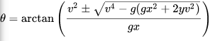

# Cannon Prediction
## General Outline
- Get coordinates, velocity, angular velocity, yaw of target
- Get coordinates, velocity of cannon
- Get velocity of cannonball, and gravity
- Calculate the time it takes for the cannonball to reach the target
- Calculate the position of the target at that time
- Calculate the angle the cannon needs to be at to hit the target
- Calculate the height to place the prediction marker at

## Coding steps
**_Work Backwards_**

1. Calculate the angle the cannon needs to be at to hit the target and the height to place the prediction marker at (render it)

    This is done using the formula

    

    where v is the velocity of the cannonball, g is the acceleration due to gravity, x is the flat distance between the cannon and the target, and y is the height difference between the cannon and the target.

    Then use simple trigonometry to calculate the height to place the prediction marker at.

2. Write a function to predict the position of the target at a given time

    Using the flat plane velocities, calculate the velocity magnitude, ```sqrt(vx^2 + vy^2)```

    The radius of the target's turn is equal to the velocity magnitude divided by the angular velocity.

    Determine the heading ```heading = atan2(vy, vx)```
    There are boundary conditions that create issues, so ensure that if ```heading - yaw > pi/2``` you subtract 2pi from heading.

    Determine if they are turning left, and store a boolean value.

    If the ship is turning left, multiply the radius by -1.

    Find the center of rotation, first find the angle to it ```theta = (heading - pi/2) if left turn else (heading + pi/2)``` then find the center of rotation ```cx = x + r*cos(theta), cy = y + r*sin(theta)```

    Now we need to use the opposite theta ```theta = (heading + pi/2) if left turn else (heading - pi/2)```

    And substitute it into ```future_x = cx + r*cos(a_v * time + theta), future_y = cy + r*sin(a_v * time theta)```

    Test your function by setting time to 0 and it should show where the ship is, then set it to 1 and it should show where the ship will be in 1 second.

    Also add a check to see if the ship isnt moving or isnt turning, and return the position or the linear prediction.

3. Calculate the time it takes for the cannonball to reach the target

    Set the best distance to infinity, and the best time to 0.

    while the distance is > 0.5 (this can be whatever value you want for precision)
        
        get future position (using best time (initially 0))

        find the distance between the cannon and the future position

        determine the time of flight using t = distance / (v * cos(theta))

        determine a new future position using the new time of flight

        find the distance between the cannon and the new future position

        calculate the difference between the two distances

4. Use these functions to render the prediction
